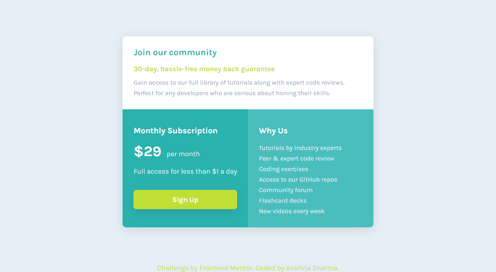

# Frontend Mentor - Single price grid component solution

This is a solution to the [Single price grid component challenge on Frontend Mentor](https://www.frontendmentor.io/challenges/single-price-grid-component-5ce41129d0ff452fec5abbbc). 

## Table of contents

- [Overview](#overview)
  - [The challenge](#the-challenge)
  - [Screenshot](#screenshot)
  - [Links](#links)
  - [Built with](#built-with)
- [Author](#author)

## Overview

Users should be able to:

1. View the optimal layout for the component depending on their device's screen size
2. See a hover state on desktop for the Sign Up call-to-action

### The challenge

Users should be able to:

- View the optimal layout for the component depending on their device's screen size
- See a hover state on desktop for the Sign Up call-to-action

### Screenshot

### Links

- Live Site URL: (https://anshii12.github.io/frontend-mentor-challenge3/)

### Built with

- Semantic HTML5 markup
- CSS custom properties
- CSS Grid
- Mobile-first workflow

### Useful resources

- [Example resource 1](https://developer.mozilla.org/en-US/docs/Web/CSS/grid-template) - This helped me for learning the concept of grid-template in css grid. I really liked this pattern and will use it going forward.

## Author

- Website - [Anshita Sharma](https://github.com/Anshii12)
- Frontend Mentor - [@Anshii12](https://www.frontendmentor.io/profile/Anshii12)

